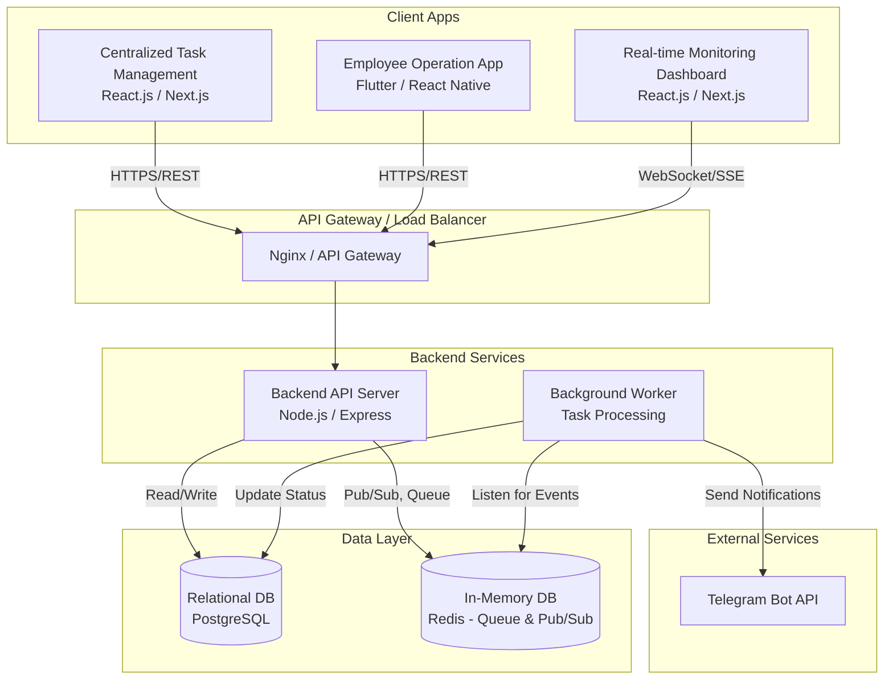
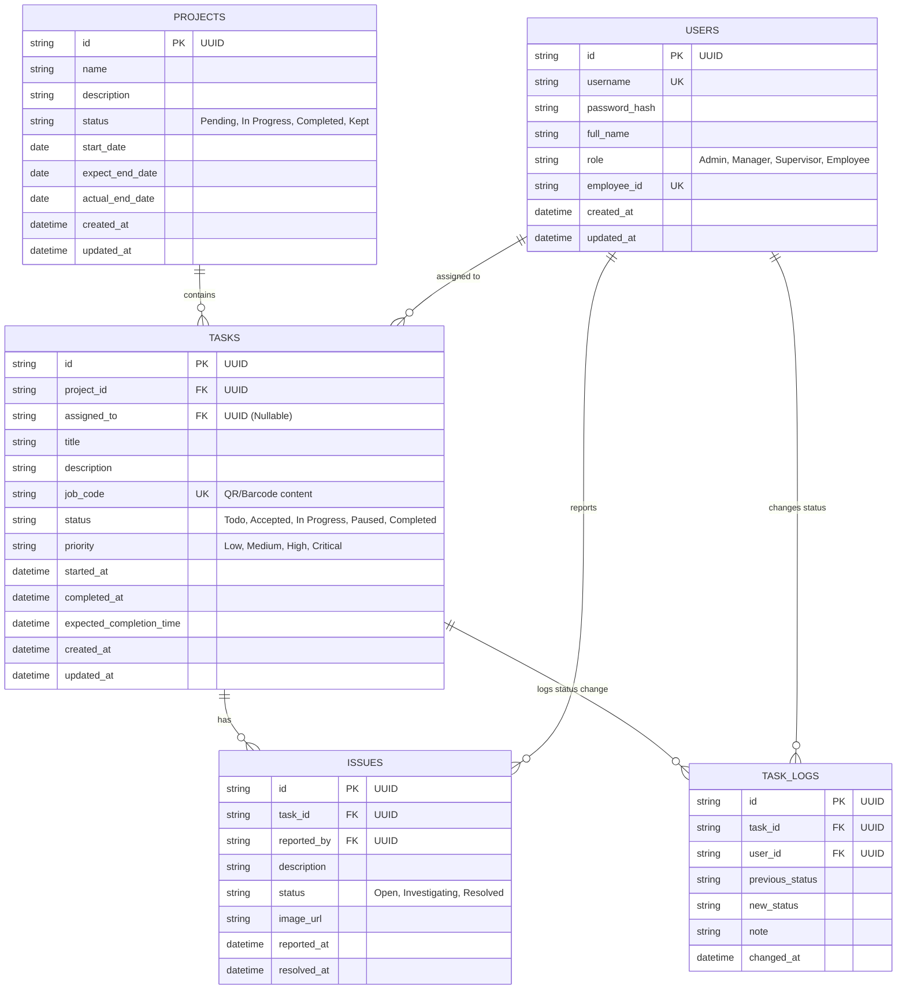

# System Architecture and Database Schema (ERD)

## 1. System Architecture Diagram

```mermaid
graph TD
  subgraph Client Apps
    WebAdmin[Centralized Task Management<br/>React.js / Next.js]
    MobileApp[Employee Operation App<br/>Flutter / React Native]
    Dashboard[Real-time Monitoring Dashboard<br/>React.js / Next.js]
  end

  subgraph API Gateway / Load Balancer
    Nginx[Nginx / API Gateway]
  end

  subgraph Backend Services
    API[Backend API Server<br/>Node.js / Express]
    Worker[Background Worker<br/>Task Processing]
  end

  subgraph Data Layer
    DB[(Relational DB<br/>PostgreSQL)]
    Cache[(In-Memory DB<br/>Redis - Queue & Pub/Sub)]
  end

  subgraph External Services
    Telegram[Telegram Bot API]
  end

  WebAdmin -->|HTTPS/REST| Nginx
  MobileApp -->|HTTPS/REST| Nginx
  Dashboard -->|WebSocket/SSE| Nginx

  Nginx --> API

  API -->|Read/Write| DB
  API -->|Pub/Sub, Queue| Cache

  Worker -->|Listen for Events| Cache
  Worker -->|Update Status| DB
  Worker -->|Send Notifications| Telegram
```

## 2. Database Schema (ERD)

```mermaid
erDiagram
  USERS {
    string id PK "UUID"
    string username UK
    string password_hash
    string full_name
    string role "Admin, Manager, Supervisor, Employee"
    string employee_id UK
    datetime created_at
    datetime updated_at
  }

  PROJECTS {
    string id PK "UUID"
    string name
    string description
    string status "Pending, In Progress, Completed, Kept"
    date start_date
    date expect_end_date
    date actual_end_date
    datetime created_at
    datetime updated_at
  }

  TASKS {
    string id PK "UUID"
    string project_id FK "UUID"
    string assigned_to FK "UUID (Nullable)"
    string title
    string description
    string job_code UK "QR/Barcode content"
    string status "Todo, Accepted, In Progress, Paused, Completed"
    string priority "Low, Medium, High, Critical"
    datetime started_at
    datetime completed_at
    datetime expected_completion_time
    datetime created_at
    datetime updated_at
  }

  ISSUES {
    string id PK "UUID"
    string task_id FK "UUID"
    string reported_by FK "UUID"
    string description
    string status "Open, Investigating, Resolved"
    string image_url
    datetime reported_at
    datetime resolved_at
  }

  TASK_LOGS {
    string id PK "UUID"
    string task_id FK "UUID"
    string user_id FK "UUID"
    string previous_status
    string new_status
    string note
    datetime changed_at
  }

  PROJECTS ||--o{ TASKS : contains
  USERS ||--o{ TASKS : "assigned to"
  TASKS ||--o{ ISSUES : "has"
  USERS ||--o{ ISSUES : "reports"
  TASKS ||--o{ TASK_LOGS : "logs status change"
  USERS ||--o{ TASK_LOGS : "changes status"
```
